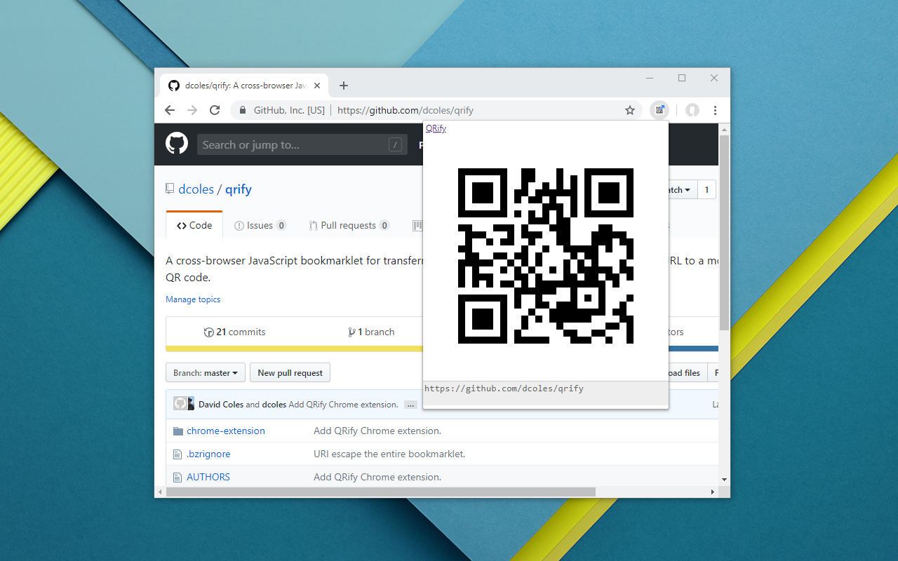

# QRify
A cross-browser JavaScript bookmarklet for transferring the currently selected text or current page's URL to a mobile device using a QR code.

[QRify in Chrome Web Store](https://chrome.google.com/webstore/detail/qrify/lipifmgeokalecfnfcnnbholkeeifmif)
